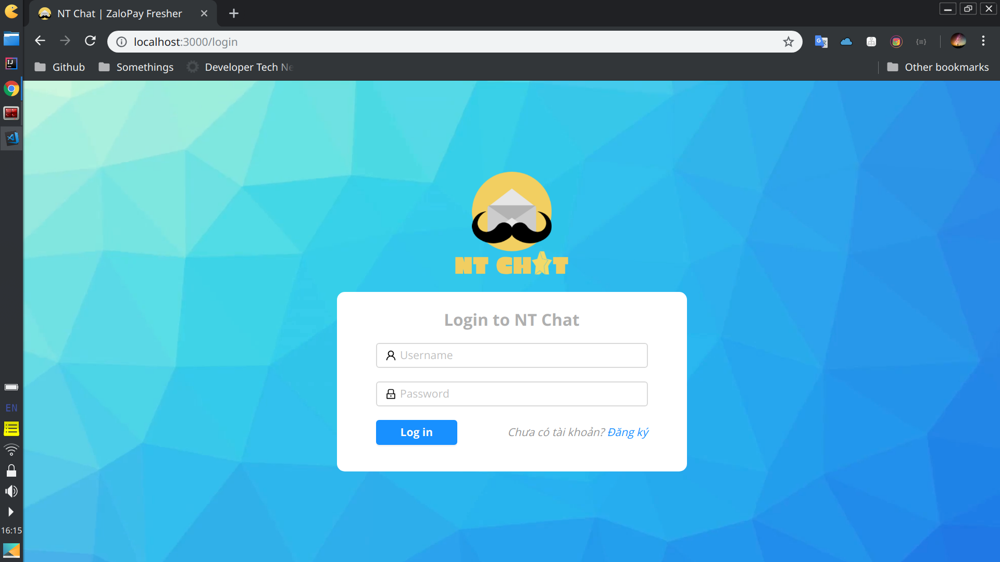
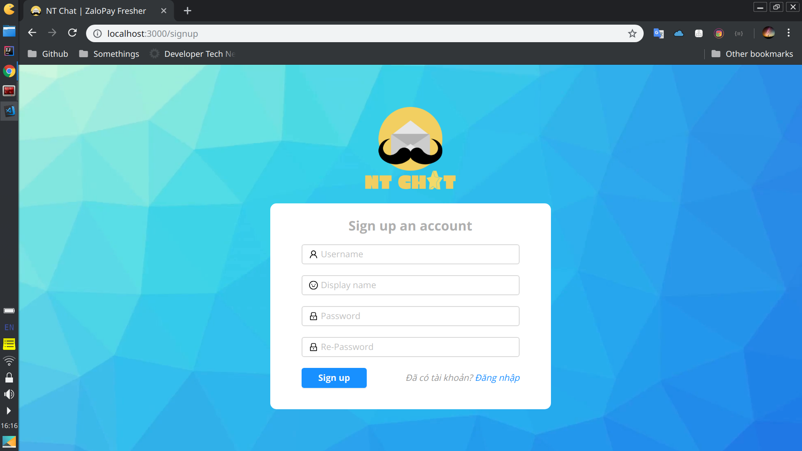
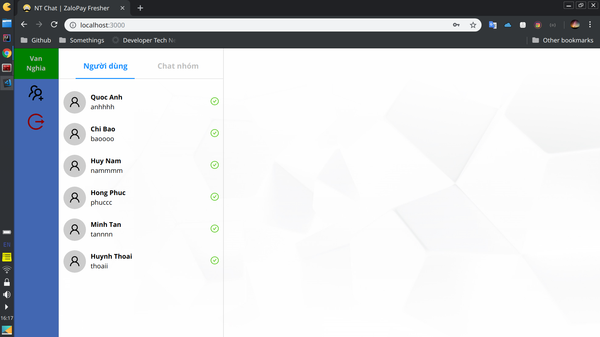
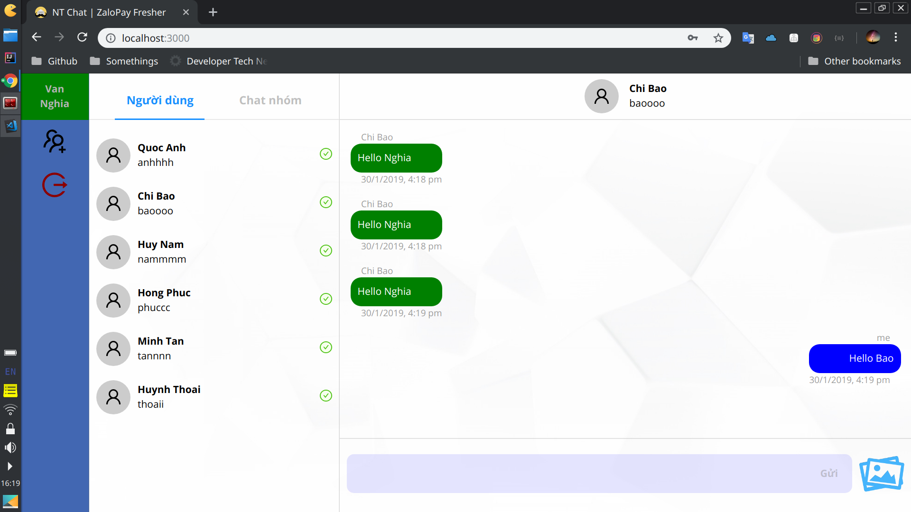
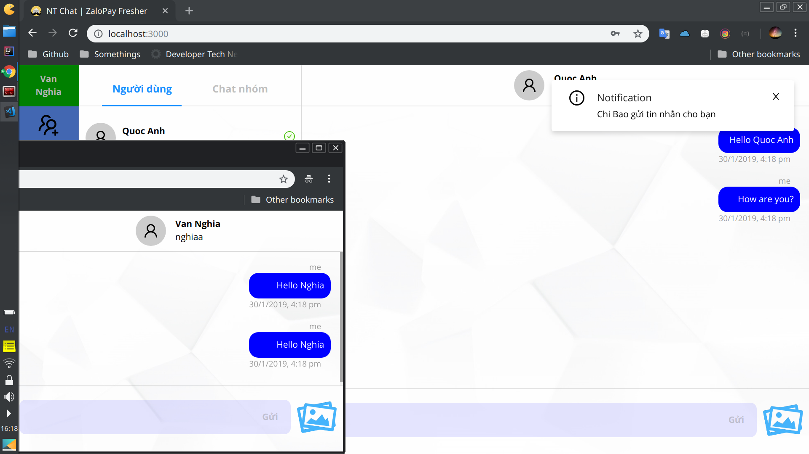
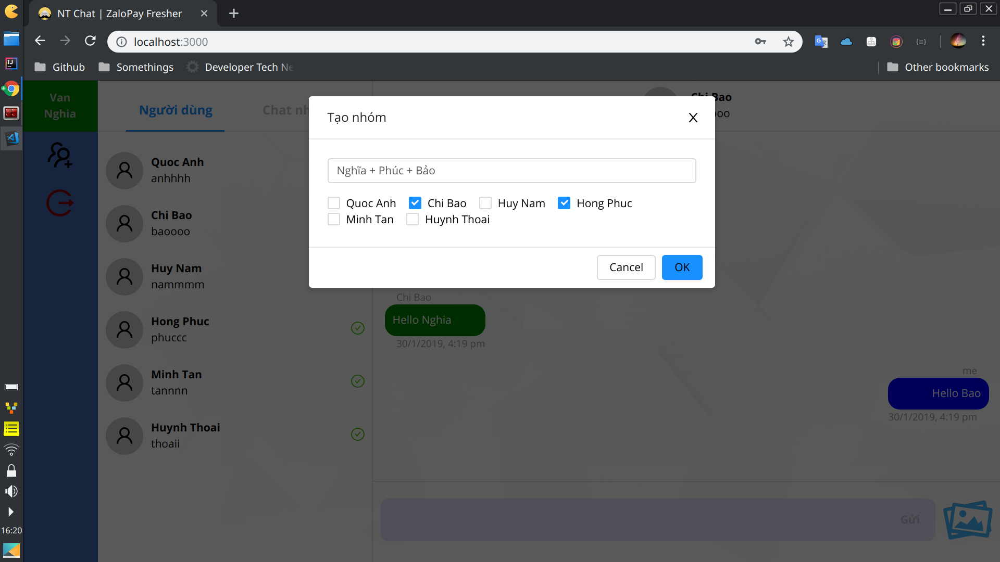
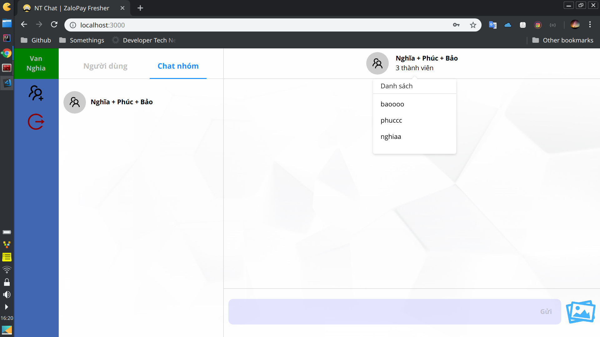
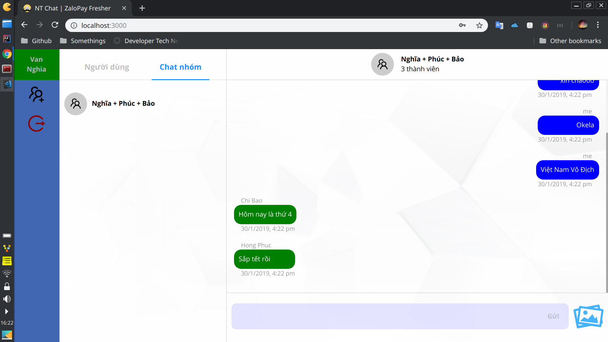

# Web Chat NT Zalopay (Front-end)

## Tính năng

- [x] Đăng nhập
- [x] Đăng ký
- [x] Chat giữa 2 user
- [x] Chat nhóm
- [x] Notification
- [x] Lịch sử chat
- [x] Gửi hình ảnh

## Sử dụng

Lưu ý: chạy Back-end trước.
````sh
npm start
````

- Đăng nhập:



- Đăng ký:



- Màn hình chính, tất cả các User đăng ký đều sẽ được hiển thị:



- Chat giữa 2 User:



- Hiển thị notification khi có người khác nhắn tin đến (khác với người mình đang chat):



- Tạo nhóm chat:



- Xem các thành viên trong nhóm chat:



- Chat nhóm:



